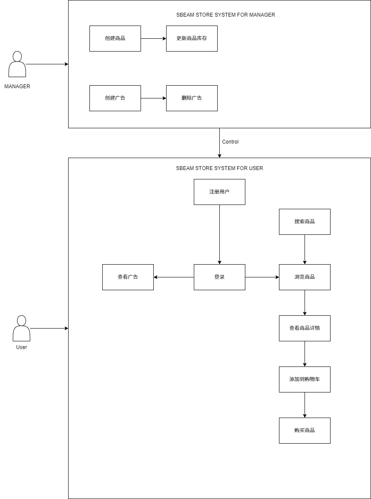

# 用例文档

## 目录

[TOC]

## 文档作者

主要编写者：李祥郡

其他编写者：戚俊涵 张铭恺 易飞翔

## 文档修改历史

| 修改人员 | 日期 | 修改原因               | 版本号 |
| -------- | ---- | ---------------------- | ------ |
| 李祥郡   | 3.18 | 新建文档               | 1.0.0  |
| 易飞翔   | 3.27 | 增加用户部分用例       | 1.0.1  |
| 戚俊涵   | 3.28 | 详细更新用户部分用例   | 1.0.2  |
| 张铭恺   | 4.3  | 增加商品部分用例       | 1.0.3  |
| 李祥郡   | 4.5  | 增加商品购买部分的用例 | 1.1.0  |
| 李祥郡   | 4.12 | 重写商品购买部分的用例 | 1.1.1  |
| 李祥郡   | 4.17 | 补充商品展示相关的用例 | 1.1.2  |
| 李祥郡   | 4.22 | 增加广告部分的用例     | 1.2.1  |
| 李祥郡   | 4.24 | 补全广告部分的用例     | 1.2.2  |

## 1. 引言

### 	1.1 目的

本用例文档旨在清晰地描述系统功能需求，通过定义用户与系统的交互场景，明确系统的行为和预期结果。文档为开发团队、测试团队、项目管理人员及其他相关利益方提供统一的功能参考，确保系统设计和实现满足用户需求，并为后续开发、测试和维护提供指导。

本文档仅为必须需求的用例文档，自选需求的用例文档在下一个文档。

### 	1.2 阅读说明	

- **目标读者**：本文档面向开发人员、测试人员、项目经理以及其他与系统开发和使用相关的利益相关者。
- **结构说明**：文档按功能模块或用户场景组织，每个用例包含用例编号、名称、描述、前置条件、基本流程、异常流程、后置条件等部分。
- **阅读建议**：建议读者根据项目角色关注相关部分，例如开发人员重点阅读基本流程和异常流程，测试人员关注前置条件和后置条件。

### 	1.3 参考文献

《软件需求（Software Requirements）》 - Karl E. Wiegers & Joy Beatty

《软件工程：实践者的研究方法》（第9版），Roger S. Pressman，人民邮电出版社，2016年。

IEEE 830-1998，《软件需求规格说明推荐实践》，IEEE标准。

《用户故事与敏捷方法》，Mike Cohn，清华大学出版社，2010年。

## 2. 用例图

## 3. 用例列表

| 参与者            | 用例（简要说明） |
| ----------------- | ---------------- |
| 所有用户 | 用户注册账户     |
| 所有用户 | 用户登录账户     |
| 所有用户 | 更新个人信息 |
| 所有用户 | 查看个人主页 |
| 管理员 | 创建商品         |
| 所有用户 | 查看商品列表  |
| 所有用户 | 搜索商品 |
|所有用户| 商品详情界面     |
|顾客| 添加到购物车 |
|顾客| 购买商品 |
|管理员| 创建广告 |
|所有用户| 查看广告 |
|顾客| 查看库存 |

## 4.详细用例描述

| ID             | 1                                                            |
| -------------- | :----------------------------------------------------------- |
| 名称           | 用户注册账户                                                 |
| 创建者         | 李祥郡                                                       |
| 创建日期       | 3.18                                                         |
| 最后一次更新者 | 易飞翔                                                       |
| 最后更新日期   | 3.27                                                         |
| 参与者         | 所有用户                                                     |
| 触发条件       | 用户点击“注册”按钮                                           |
| 前置条件       | 用户尚未注册                                                 |
| 后置条件       | 用户成功注册，获得账户，系统记录用户信息，用户可以登录       |
| 优先级         | 高优先级                                                     |
| 正常流程       | 用户点击注册按钮，在系统中填写用户名，手机号，密码，确认密码，选择身份，如果选择供应商的身份，选择自己的商店。 |
| 扩展流程       | 如果手机号重复，会注册失败；如果确认密码与密码不同，会注册失败 |
| 特殊需求       | 应该有足够的提示，防止无法注册；密码应该加密存储，确保用户隐私。 |

| ID             | 2                                                            |
| -------------- | ------------------------------------------------------------ |
| 名称           | 用户登录账户                                                 |
| 创建者         | 李祥郡                                                       |
| 创建日期       | 3.18                                                         |
| 最后一次更新者 | 易飞翔                                                       |
| 最后更新日期   | 3.27                                                         |
| 参与者         | 用户、SBEAM系统                                              |
| 触发条件       | 用户填写完手机号和密码，并点击“登录”按钮                     |
| 前置条件       | 用户已经有账户，手机号和密码正确                             |
| 后置条件       | 用户成功登录，进入个人信息界面，并且可以执行后续的查看所有商店，执行购买。 |
| 优先级         | 高优先级                                                     |
| 正常流程       | 用户在登陆界面填写手机号和密码，填写成功后点击“登录”按钮。   |
| 扩展流程       | 如果手机号和密码不能匹配，会提醒手机号或密码错误             |
| 特殊需求       | 应该有足够的提示，防止无法登录；密码应该加密存储，确保用户隐私。 |

| ID             | 3                                            |
| -------------- | -------------------------------------------- |
| 名称           | 更新个人信息                                 |
| 创建者         | 李祥郡                                       |
| 创建日期       | 3.18                                         |
| 最后一次更新者 | 戚俊涵                                       |
| 最后更新日期   | 3.27                                         |
| 参与者         | 所有用户                                     |
| 触发条件       | 用户已经登录，进入个人信息界面               |
| 前置条件       | 用户更新的信息（包括头像，密码）符合要求     |
| 后置条件       | 用户成功更新信息，将以新的状态进入SBEAM系统  |
| 优先级         | 高优先级                                     |
| 正常流程       | 用户在更新信息界面填写更新后的内容           |
| 扩展流程       | 如果新信息不符合要求，则应有报错提醒         |
| 特殊需求       | 应该有足够多的提示，防止用户始终无法更新信息 |

| 项目           | 内容                                       |
| -------------- | ------------------------------------------ |
| ID             | 4                                          |
| 名称           | 查看个人主页                               |
| 创建者         | 李祥郡                                     |
| 创建日期       | 3.18                                       |
| 最后一次更新者 | 戚俊涵                                     |
| 最后更新日期   | 3.28                                       |
| 参与者         | 所有用户                                   |
| 触发条件       | 用户登录后选择查看个人主页                 |
| 前置条件       | 用户已成功登录系统                         |
| 后置条件       | 显示用户的个人信息和相关数据               |
| 优先级         | 中优先级                                   |
| 正常流程       | 用户点击个人主页链接，系统显示个人信息页面 |
| 扩展流程       | 如果数据加载失败，显示错误信息             |
| 特殊需求       | 页面加载速度要快，信息显示完整             |

| 项目           | 内容                                               |
| -------------- | -------------------------------------------------- |
| ID             | 5                                                  |
| 名称           | 创建商品                                           |
| 创建者         | 李祥郡                                             |
| 创建日期       | 3.18                                               |
| 最后一次更新者 | 张铭恺                                             |
| 最后更新日期   | 3.28                                               |
| 参与者         | 管理员                                             |
| 触发条件       | 管理员选择创建新商品                               |
| 前置条件       | 管理员已登录且具有商品管理权限                     |
| 后置条件       | 新商品成功创建并添加到商品库                       |
| 优先级         | 高优先级                                           |
| 正常流程       | 管理员填写商品信息（名称、价格、描述等），提交创建 |
| 扩展流程       | 如果商品信息不完整或格式错误，显示验证错误         |
| 特殊需求       | 支持图片上传，价格格式验证                         |

| 项目           | 内容                                   |
| -------------- | -------------------------------------- |
| ID             | 6                                      |
| 名称           | 查看商品列表                           |
| 创建者         | 李祥郡                                 |
| 创建日期       | 3.18                                   |
| 最后一次更新者 | 张铭恺                                 |
| 最后更新日期   | 4.3                                    |
| 参与者         | 所有用户                               |
| 触发条件       | 用户访问商品展示页面                   |
| 前置条件       | 系统中存在商品数据                     |
| 后置条件       | 显示商品列表供用户浏览                 |
| 优先级         | 高优先级                               |
| 正常流程       | 用户进入商品页面，系统显示所有可用商品 |
| 扩展流程       | 支持商品筛选、排序和分页功能           |
| 特殊需求       | 页面响应速度快，支持搜索功能           |

| 项目           | 内容                                   |
| -------------- | -------------------------------------- |
| ID             | 7                                      |
| 名称           | 搜索商品                               |
| 创建者         | 李祥郡                                 |
| 创建日期       | 3.18                                   |
| 最后一次更新者 | 张铭恺                                 |
| 最后更新日期   | 4.3                                    |
| 参与者         | 所有用户                               |
| 触发条件       | 用户在搜索框输入关键词                 |
| 前置条件       | 系统中存在商品数据                     |
| 后置条件       | 显示符合搜索条件的商品列表             |
| 优先级         | 中优先级                               |
| 正常流程       | 用户输入关键词，系统返回匹配的商品结果 |
| 扩展流程       | 如果没有找到匹配商品，显示"无结果"信息 |
| 特殊需求       | 支持模糊搜索，搜索速度要快             |

| 项目           | 内容                                                 |
| -------------- | ---------------------------------------------------- |
| ID             | 8                                                    |
| 名称           | 商品详情界面                                         |
| 创建者         | 李祥郡                                               |
| 创建日期       | 3.18                                                 |
| 最后一次更新者 | 李祥郡                                               |
| 最后更新日期   | 4.5                                                  |
| 参与者         | 所有用户                                             |
| 触发条件       | 用户点击某个商品查看详情                             |
| 前置条件       | 商品信息存在且可访问                                 |
| 后置条件       | 显示商品的详细信息页面                               |
| 优先级         | 高优先级                                             |
| 正常流程       | 用户点击商品，系统显示详细信息包括图片、价格、描述等 |
| 扩展流程       | 如果商品不存在，显示错误页面                         |
| 特殊需求       | 图片加载清晰，信息展示完整                           |

| 项目           | 内容                                       |
| -------------- | ------------------------------------------ |
| ID             | 9                                          |
| 名称           | 添加到购物车                               |
| 创建者         | 李祥郡                                     |
| 创建日期       | 3.18                                       |
| 最后一次更新者 | 李祥郡                                     |
| 最后更新日期   | 4.5                                        |
| 参与者         | 顾客                                       |
| 触发条件       | 顾客在商品页面点击"添加到购物车"           |
| 前置条件       | 顾客已登录，商品有库存                     |
| 后置条件       | 商品成功添加到用户购物车                   |
| 优先级         | 高优先级                                   |
| 正常流程       | 顾客选择商品数量，点击添加，系统更新购物车 |
| 扩展流程       | 如果库存不足，提示用户并限制添加数量       |
| 特殊需求       | 实时库存检查，购物车状态同步               |

| 项目           | 内容                                       |
| -------------- | ------------------------------------------ |
| ID             | 10                                         |
| 名称           | 购买商品                                   |
| 创建者         | 李祥郡                                     |
| 创建日期       | 3.18                                       |
| 最后一次更新者 | 李祥郡                                     |
| 最后更新日期   | 4.17                                       |
| 参与者         | 顾客                                       |
| 触发条件       | 顾客点击购买或结算                         |
| 前置条件       | 顾客已登录，购物车中有商品，有有效支付方式 |
| 后置条件       | 订单创建成功，库存更新，发送确认信息       |
| 优先级         | 高优先级                                   |
| 正常流程       | 顾客确认订单信息，选择支付方式，完成支付   |
| 扩展流程       | 如果支付失败，保留订单并提示重新支付       |
| 特殊需求       | 安全的支付处理，订单确认机制               |

| 项目           | 内容                                           |
| -------------- | ---------------------------------------------- |
| ID             | 11                                             |
| 名称           | 创建广告                                       |
| 创建者         | 李祥郡                                         |
| 创建日期       | 3.18                                           |
| 最后一次更新者 | 李祥郡                                         |
| 最后更新日期   | 4.22                                           |
| 参与者         | 管理员                                         |
| 触发条件       | 管理员选择创建新广告                           |
| 前置条件       | 管理员已登录且具有广告管理权限                 |
| 后置条件       | 新广告成功创建并可以在系统中显示               |
| 优先级         | 中优先级                                       |
| 正常流程       | 管理员设置广告内容、位置、时间等参数，提交创建 |
| 扩展流程       | 如果广告内容不符合规范，显示错误提示           |
| 特殊需求       | 支持多种广告格式，定时发布功能                 |

| 项目           | 内容                                 |
| -------------- | ------------------------------------ |
| ID             | 12                                   |
| 名称           | 查看广告                             |
| 创建者         | 李祥郡                               |
| 创建日期       | 3.18                                 |
| 最后一次更新者 | 李祥郡                               |
| 最后更新日期   | 4.22                                 |
| 参与者         | 所有用户                             |
| 触发条件       | 用户访问包含广告的页面               |
| 前置条件       | 系统中存在有效的广告内容             |
| 后置条件       | 广告正确显示给用户                   |
| 优先级         | 低优先级                             |
| 正常流程       | 用户浏览页面时，系统自动显示相关广告 |
| 扩展流程       | 如果广告加载失败，不影响主要功能     |
| 特殊需求       | 广告加载不能影响页面性能             |

| 项目           | 内容                                   |
| -------------- | -------------------------------------- |
| ID             | 13                                     |
| 名称           | 查看库存                               |
| 创建者         | 李祥郡                                 |
| 创建日期       | 3.18                                   |
| 最后一次更新者 | 李祥郡                                 |
| 最后更新日期   | 4.24                                   |
| 参与者         | 顾客                                   |
| 触发条件       | 顾客查询商品库存信息                   |
| 前置条件       | 商品存在于系统中                       |
| 后置条件       | 显示准确的库存数量信息                 |
| 优先级         | 中优先级                               |
| 正常流程       | 顾客查看商品页面，系统显示当前库存状态 |
| 扩展流程       | 如果库存为0，显示"缺货"状态            |
| 特殊需求       | 库存信息实时更新，准确可靠             |
