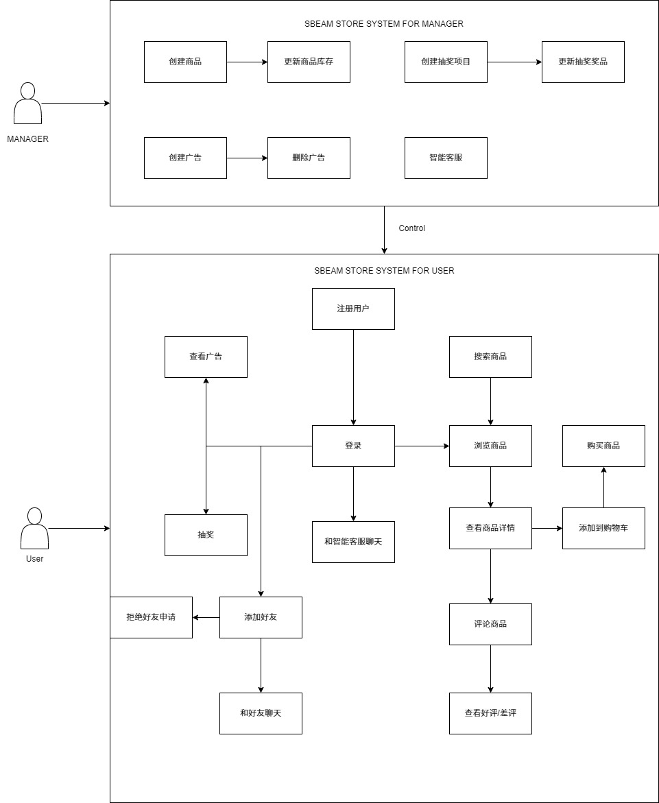

# 自由需求的用例文档

## 目录

[TOC]

## 文档作者

主要编写者：李祥郡

其他编写者：戚俊涵 张铭恺 易飞翔

## 文档修改历史

| 修改人员 | 日期 | 修改原因               | 版本号 |
| -------- | ---- | ---------------------- | ------ |
| 李祥郡   | 4.1  | 新建文档               | 1.0.0  |
| 李祥郡   | 4.7  | 增加评论部分用例       | 1.0.1  |
| 李祥郡   | 4.11 | 详细更新评论部分用例   | 1.0.2  |
| 李祥郡   | 4.17 | 增加抽奖部分用例       | 1.0.3  |
| 李祥郡   | 4.20 | 增加好友部分的用例     | 1.1.0  |
| 李祥郡   | 4.27 | 重写好友聊天部分的用例 | 1.1.1  |
| 李祥郡   | 5.1  | 增加智能客服相关的用例 | 1.1.2  |
| 李祥郡   | 5.7  | 修改智能客服部分的用例 | 1.2.1  |

## 1.引言

### 1.1目的

本用例文档旨在清晰地描述系统功能需求，通过定义用户与系统的交互场景，明确系统的行为和预期结果。文档为开发团队、测试团队、项目管理人员及其他相关利益方提供统一的功能参考，确保系统设计和实现满足用户需求，并为后续开发、测试和维护提供指导。

本文档仅为自选需求的用例文档，必选需求的用例文档在上一个文档。

### 1.2阅读说明

- **目标读者**：本文档面向开发人员、测试人员、项目经理以及其他与系统开发和使用相关的利益相关者。
- **结构说明**：文档按功能模块或用户场景组织，每个用例包含用例编号、名称、描述、前置条件、基本流程、异常流程、后置条件等部分。
- **阅读建议**：建议读者根据项目角色关注相关部分，例如开发人员重点阅读基本流程和异常流程，测试人员关注前置条件和后置条件。

### 1.3参考文献

《软件需求（Software Requirements）》 - Karl E. Wiegers & Joy Beatty

《软件工程：实践者的研究方法》（第9版），Roger S. Pressman，人民邮电出版社，2016年。

IEEE 830-1998，《软件需求规格说明推荐实践》，IEEE标准。

《用户故事与敏捷方法》，Mike Cohn，清华大学出版社，2010年。

## 2.用例图

## 3.用例列表

| 参与者   | 用例(简要说明)   |
| -------- | ---------------- |
| 顾客     | 评论商品         |
| 所有用户 | 查看好评/差评    |
| 管理员   | 创建抽奖项目     |
| 管理员   | 管理抽奖项目奖品 |
| 顾客     | 抽奖             |
| 顾客     | 添加好友         |
| 顾客     | 拒绝好友申请     |
| 顾客     | 同意好友申请     |
| 顾客     | 和好友聊天       |
| 顾客     | 和智能客服聊天   |

## 4.详细用例描述

| 项目           | 内容                                                         |
| -------------- | ------------------------------------------------------------ |
| ID             | 1                                                            |
| 名称           | 评论商品                                                     |
| 创建者         | 李祥郡                                                       |
| 创建日期       | 4.1                                                          |
| 最后一次更新者 | 李祥郡                                                       |
| 最后更新日期   | 4.7                                                          |
| 参与者         | 顾客                                                         |
| 触发条件       | 顾客购买商品后选择评论                                       |
| 前置条件       | 顾客已登录且已购买该商品                                     |
| 后置条件       | 评论成功提交并显示在商品页面                                 |
| 优先级         | 中优先级                                                     |
| 正常流程       | 顾客在商品页面或订单页面点击评论，填写评论内容和评分，提交评论 |
| 扩展流程       | 如果评论内容包含敏感词汇，系统提示修改后重新提交             |
| 特殊需求       | 评论内容审核机制，支持图片上传，评分范围1-5星                |

| 项目           | 内容                                               |
| -------------- | -------------------------------------------------- |
| ID             | 2                                                  |
| 名称           | 查看好评/差评                                      |
| 创建者         | 李祥郡                                             |
| 创建日期       | 4.1                                                |
| 最后一次更新者 | 李祥郡                                             |
| 最后更新日期   | 4.11                                               |
| 参与者         | 所有用户                                           |
| 触发条件       | 用户在商品页面选择查看评论                         |
| 前置条件       | 商品存在评论数据                                   |
| 后置条件       | 显示按好评/差评筛选的评论列表                      |
| 优先级         | 中优先级                                           |
| 正常流程       | 用户点击好评或差评筛选按钮，系统显示相应的评论内容 |
| 扩展流程       | 如果没有相应类型的评论，显示"暂无评论"提示         |
| 特殊需求       | 评论按时间排序，支持点赞功能，显示评论者信息       |

| 项目           | 内容                                                 |
| -------------- | ---------------------------------------------------- |
| ID             | 3                                                    |
| 名称           | 创建抽奖项目                                         |
| 创建者         | 李祥郡                                               |
| 创建日期       | 4.1                                                  |
| 最后一次更新者 | 李祥郡                                               |
| 最后更新日期   | 4.17                                                 |
| 参与者         | 管理员                                               |
| 触发条件       | 管理员选择创建新的抽奖活动                           |
| 前置条件       | 管理员已登录且具有活动管理权限                       |
| 后置条件       | 抽奖项目成功创建并可供用户参与                       |
| 优先级         | 中优先级                                             |
| 正常流程       | 管理员设置抽奖名称、奖品、参与条件、时间等，提交创建 |
| 扩展流程       | 如果设置信息不完整，系统提示补充必要信息             |
| 特殊需求       | 支持多种奖品设置，定时开奖功能，参与条件灵活配置     |

| 项目           | 内容                                                   |
| -------------- | ------------------------------------------------------ |
| ID             | 4                                                      |
| 名称           | 管理抽奖项目奖品                                       |
| 创建者         | 李祥郡                                                 |
| 创建日期       | 4.1                                                    |
| 最后一次更新者 | 李祥郡                                                 |
| 最后更新日期   | 4.17                                                   |
| 参与者         | 管理员                                                 |
| 触发条件       | 管理员选择管理已创建的抽奖奖品                         |
| 前置条件       | 抽奖项目已存在，管理员有相应权限                       |
| 后置条件       | 奖品信息更新成功                                       |
| 优先级         | 中优先级                                               |
| 正常流程       | 管理员查看抽奖项目，编辑奖品名称、数量、中奖概率等信息 |
| 扩展流程       | 如果抽奖已开始，限制某些关键信息的修改                 |
| 特殊需求       | 奖品库存管理，中奖概率设置，奖品图片上传               |

| 项目           | 内容                                         |
| -------------- | -------------------------------------------- |
| ID             | 5                                            |
| 名称           | 抽奖                                         |
| 创建者         | 李祥郡                                       |
| 创建日期       | 4.1                                          |
| 最后一次更新者 | 李祥郡                                       |
| 最后更新日期   | 4.17                                         |
| 参与者         | 顾客                                         |
| 触发条件       | 顾客点击参与抽奖活动                         |
| 前置条件       | 顾客已登录，满足抽奖参与条件，抽奖活动进行中 |
| 后置条件       | 显示抽奖结果，如中奖则记录获奖信息           |
| 优先级         | 中优先级                                     |
| 正常流程       | 顾客点击抽奖按钮，系统随机生成结果并显示     |
| 扩展流程       | 暂无                                         |
| 特殊需求       | 公平的随机算法，防止作弊机制，中奖记录保存   |

| 项目           | 内容                                                         |
| -------------- | ------------------------------------------------------------ |
| ID             | 6                                                            |
| 名称           | 添加好友                                                     |
| 创建者         | 李祥郡                                                       |
| 创建日期       | 4.1                                                          |
| 最后一次更新者 | 李祥郡                                                       |
| 最后更新日期   | 4.20                                                         |
| 参与者         | 顾客                                                         |
| 触发条件       | 顾客搜索并选择添加其他用户为好友                             |
| 前置条件       | 顾客已登录，目标用户存在                                     |
| 后置条件       | 发送好友申请或直接添加为好友                                 |
| 优先级         | 低优先级                                                     |
| 正常流程       | 顾客搜索用户名或扫描二维码，点击添加好友                     |
| 扩展流程       | 如果对方设置需要验证，发送好友申请；如果对方不存在，显示错误提示 |
| 特殊需求       | 用户隐私设置，好友申请通知，防止骚扰机制                     |

| 项目           | 内容                             |
| -------------- | -------------------------------- |
| ID             | 7                                |
| 名称           | 拒绝好友申请                     |
| 创建者         | 李祥郡                           |
| 创建日期       | 4.1                              |
| 最后一次更新者 | 李祥郡                           |
| 最后更新日期   | 4.20                             |
| 参与者         | 顾客                             |
| 触发条件       | 顾客收到好友申请并选择拒绝       |
| 前置条件       | 存在待处理的好友申请             |
| 后置条件       | 好友申请被拒绝，申请者收到通知   |
| 优先级         | 低优先级                         |
| 正常流程       | 顾客在好友申请列表中点击拒绝按钮 |
| 扩展流程       | 可选择是否告知拒绝原因           |
| 特殊需求       | 拒绝记录保存，防止重复申请机制   |

| 项目           | 内容                                               |
| -------------- | -------------------------------------------------- |
| ID             | 8                                                  |
| 名称           | 同意好友申请                                       |
| 创建者         | 李祥郡                                             |
| 创建日期       | 4.1                                                |
| 最后一次更新者 | 李祥郡                                             |
| 最后更新日期   | 4.20                                               |
| 参与者         | 顾客                                               |
| 触发条件       | 顾客收到好友申请并选择同意                         |
| 前置条件       | 存在待处理的好友申请                               |
| 后置条件       | 双方成为好友，可进行好友间的互动                   |
| 优先级         | 低优先级                                           |
| 正常流程       | 顾客在好友申请列表中点击同意按钮，系统建立好友关系 |
| 扩展流程       | 同意后自动发送成为好友的通知                       |
| 特殊需求       | 好友关系双向建立，好友列表实时更新                 |

| 项目           | 内容                                                   |
| -------------- | ------------------------------------------------------ |
| ID             | 9                                                      |
| 名称           | 和好友聊天                                             |
| 创建者         | 李祥郡                                                 |
| 创建日期       | 4.1                                                    |
| 最后一次更新者 | 李祥郡                                                 |
| 最后更新日期   | 4.27                                                   |
| 参与者         | 顾客                                                   |
| 触发条件       | 顾客选择与好友进行聊天                                 |
| 前置条件       | 双方已为好友关系，均已登录                             |
| 后置条件       | 聊天消息成功发送和接收                                 |
| 优先级         | 中优先级                                               |
| 正常流程       | 顾客点击好友头像进入聊天界面，发送文字、图片或表情消息 |
| 扩展流程       | 如果好友离线，消息保存待其上线时接收                   |
| 特殊需求       | 实时消息推送，消息历史记录，支持多媒体消息             |

| 项目           | 内容                                       |
| -------------- | ------------------------------------------ |
| ID             | 10                                         |
| 名称           | 和智能客服聊天                             |
| 创建者         | 李祥郡                                     |
| 创建日期       | 4.1                                        |
| 最后一次更新者 | 李祥郡                                     |
| 最后更新日期   | 5.7                                        |
| 参与者         | 顾客                                       |
| 触发条件       | 顾客需要帮助时点击客服功能                 |
| 前置条件       | 顾客已登录                                 |
| 后置条件       | 顾客获得问题解答或转接人工客服             |
| 优先级         | 高优先级                                   |
| 正常流程       | 顾客输入问题，智能客服基于知识库提供答案   |
| 扩展流程       | 如果智能客服无法解答，提供转接人工客服选项 |
| 特殊需求       | 自然语言处理能力，常见问题库               |